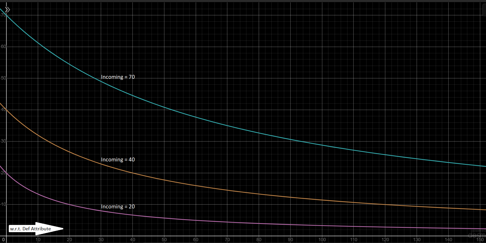

# Introduction

# Character

## Playable Races

The most basic identity of the player character is their race. There are plans for 4 playable races: human, dwarf, elf, half-giant. However, in the current version, human is the only playable race since the re-writing of the story required for other races has not been completed.

### Human

*"Disease, weed and human… let a little bit sprout up and sooner than you expect, the world’s full of it." ~ a proud elf*

The most common race in the continent has also been holding the most political power for over three hundred years. Humans are smart, diplomatic and excellent strategists. This race is not as ancient as dwarves or elves, nor do humans live as long. But they bear child more often, and are much eager to expand their reach. Their smiths are not as skilled as those of the dwarves, but their innovation is unparalleled. Their mages are not as powerful as those of the elves, but their thirst for knowledge knows no bounds. Humans of Zeneria are predominantly brown skinned, dark haired, tall and healthy. Their lives span anywhere between seventy to ninety years, unless taken early.

### Dwarf

*"Dwarves have mined these lands for fifteen millennia. If you dig now and find gold, it’s not mining, it’s archeology." ~ an Ozar merchant*

Delvers of the deep and artificers of the most legendary creations in history, the dwarves have dwelt in Zeneria for over ten thousand years before the first humans were known to exist. The tales of lost dwarven cities full of boundless treasure have spelled doom for many adventurers through the ages. Dwarves can naturally live significantly longer lives than humans, but their love of battle glory make that difficult. They also love stories and ale, both of which are found aplenty in taverns, where happy dwarves are a common sight. Dwarves are of short stature and light skin, and their hair varies from fiery red to dark brown. Their natural lifespan is of about hundred and thirty to hundred and seventy years, but their life expectancy is usually not over hundred and ten.

### Elf

*"Elves live long enough to master several disciplines our lives are just too short for. Humility isn't one of them." ~ a veteran human*

Twelve centuries before humans named it the Zenerian Empire, an elf king united the powers of the continent into one. \
Continental elves are willowy and fair. The colour of their hair ranges from light auburn to golden, although some prefer to dye their hair with darker shades. Elves have lives that can span ten times the length of human ones, and they do much to maintain it so.

### Half-giant

*"Half-giants have been allies to dwarves since dawn of time, even though, one might say we don't quite see eye to eye, heh." ~ a drunk dwarf*

People of this race are not a common sight, but their presence is hard to miss. \
Half-giants are towering hulks of inhuman strength, but despite their obvious physical advantages, they do not naturally live longer than sixty years. They are pale of skin and their hair varies from the colour of ash to the colour of snow.

# Combat

## Overview

- Combat is turn-based and symmetric. The number of turns each participant gets in a round is equal to the participant's Athletic skill, which also determines the turn order, except if the battle starts with an ambush (then the attacked team misses the first round).
- During their turns, participants have the option to Move or use a Spell instead of attacking with their weapons.
- Moving is one-dimensional, and the maximum distance moved per turn is also equal to the participant’s Athletic skill, unless teleportation is involved. Participants with any form of teleportation can move out of turn, and without limits. If the player's distance from the nearest enemy exceeds 100 (some combats may not allow this), combat ends.
- Having low enough Spirit during combat causes the player to panic and be forced to move randomly during some turns until Spirit stabilises.
- Outgoing damage is based on only the equipped weapon(s) which can attack an enemy at the chosen range. If the player chooses to attack an enemy outside the range of all of the player's equipped weapons, the turn will simply fail.
- Some spells may require the caster to skip one or more rounds (not turns) before or after the their usage. How many rounds need to be skipped depends entirely on the spell, and is not affected by the caster's Athletic skill.
- Nothing in the inventory except Specials (potions and glyphs are examples of specials) can be accessed during combat, and no extra turn is lost by their usage, unless specified otherwise in the item description. However, the inventory cannot be accessed out of turn.

## Physical Damage

Physical damage is a vector of three dimensions. The three coefficients of physical damage are blunt damage, cutting damage and piercing damage. All calculations are done separately and symmetrically regarding these coefficients. Both the Def and Dmg attributes, as well as weapon Power and armour Rating are all 3D vectors.

### Dealing Damage

#### Things to note:

- Outgoing physical damage is determined by the attacker’s equipped weapon(s), Strength attribute, Dmg modifiers, Martial skill and the defender’s Martial skill.
- The maximum damage potential of a weapon is its Power, and the further the total Weight of equipped weapon(s) exceeds the Strength of the wielder, the less effective each weapon will become in proportion to its Power.
- If the Martial skill of a combatant is lower than that of the opponent's, the former's outgoing damage will be reduced, and the latter's increased. If the defender's Martial skill is double or more of that of the attacker's, the former will completely evade every attack from the latter.

#### Calculations:

```
WeaponDam = min(Power, Power*Strength/TotalWeight)
BaseDmg = Sum of valid WeaponDams
E = max(0, (2*Martial-OppMartial)/Martial)
Outgoing = Mod(E*BaseDmg)
[In the Stats screen, E = 1]
```

### Taking Damage

#### Things to note:

- The attacker’s outgoing damage is the defender’s incoming damage. The damage taken is determined by the incoming damage, the defender’s equipped armour piece(s) (including shield) and Def modifiers.
- The further the total Weight of protective equipment exceeds Strength, the slower the wearer becomes.
- The defence potential of each piece of armour is its Rating. Each piece of physical armour contributes a fixed percentage to the wearer's Def attributes, for instance a cuirass has more effect on Def even if a pair of gauntlets have the same Rating, because torso armour protects 50% of the body, and hand armour protects only 5%.
- The percentage contribution of a shield to the Def attribute is ten times the wielder's Martial skill. However, not only does equipping a shield prohibit the usage of both hands for weapon, but the shield Weight counts towards total armour Weight.
- The Def attribute always reduces damage taken, but never completely eliminates it. The higher the incoming damage, the more damage will be subtracted, but the percentage of the damage reduced will become smaller.
- The amount of damage subtracted can never exceed the value of Def.

#### Calculations:

```
BaseDef = head*20%+torso*50%+arms*10%+legs*10%+hands*5%+feet*5%+shield*(10*Martial)%
= (head*4+torso*10+arms*2+legs*2+hands+feet+shield*2*Martial)/20
EffDamage = Inc*Inc/(Inc+Mod(BaseDef))
[Where Inc = Incoming damage]
```

> If you are on GitHub and cannot see the following image, please use a VPN or connect through a different ISP.


The above graph shows how received damage may change with respect to incoming damage at different fixed values of the Def attribute. More damage is blocked as the incoming damage increases, but the percentage of the incoming damage being blocked becomes smaller. \
For example, with Def=20, an incoming damage of 5 may be reduced to 1 (subtraction=4, percentage reduction=80%), and a damage of 30 may be reduced to 18 (subtraction=12, percentage reduction=40%). So as the incoming damage increases (5 to 30), the amount of the subtracted damage increases (4 to 12), but its value in relation to the total incoming damage, decreases (80% to 40%). [[also see Appendix-1]](#appendix-1-a-rant-about-ac)

## Modifiers

Modifiers change the effective Dmg or Def attribute of the combatant during each turn. The order of applying combat modifiers is as below:

Racial, Class, Enchantment, Effect, Opposition, Chaos \
[Within each type, additive modifiers are applied on top of multiplicative ones]

Enchantments come from equipped items. \
Effects come from blessings, curses, spells, potions and carried items. \
Opposition modifiers are effectiveness buffs and debuffs against certain enemies or equipments. \
Chaos is a somewhat random additive modifier. Chaos level is determined at the beginning of combat. There are 5 levels of Chaos: Low, Mild, Moderate, High, Extreme. These are the respective ranges of Chaos at each level:

* Low = -2 to +2
* Mild = -6 to +6
* Moderate = -12 to +12
* High = -20 to +20
* Extreme = -32 to +32

In Azerog (Warmouth), Chaos level is never below Moderate. But in most other places, it is rarely above Moderate. Each gem of Nurileth elevates the combat by one Chaos level. The Chaos modifier is rolled during each turn based on the Chaos level and added to the attacking Dmg of that turn. Chaos also affects transactions but with a different mechanism.

# Gameplay

# Story

# World

# Technical Details

# Appendices

## Appendix-1: A Rant About AC

I did not want to implement AC the way it works in D&D, because it feels to me less like armour and more like dodging skill. Since no one wants to engage in even more manual number crunching in the middle of an intense battle than what we already do, that is good enough for a TTRPG. But in a game where all the calculations are handled by the computer, we can do better. The two simplest and perhaps the most common ways to calculate defence in games are what I call "cutoff" and "damping". In the former, a flat amount is removed from the incoming damage, and in the latter a fixed fraction of the incoming damage is absorbed. One subtracts, the other divides. But in my opinion, neither of these reflect reality adequately. The problem with "damping" is that in reality, something that can absorb half of a light damage usually can absorb only less than half of heavier damages, and something that can absorb half of a heavy damage, usually takes off more than half of lighter damages. On the other hand, "cutoff" armors have been given the potential to entirely nullify smaller attacks, whereas in reality we can feel softer knocks and bumps even through something that can protect us from stronger hits. One way we could avoid these two problems is by using a hybrid process to calculate defence. It could be a "damping" defence up until a threshold value, after which it becomes a "cutoff" defence. But this solution did not feel as elegant as the one I eventually came up with. And I was so proud of the one I came up with, that I finally ended up using it in my game just to serve my vanity. Not only does the defence I designed absorb higher percentages of lighter damages like the "cutoff" systems yet negate higher flat values from heavier damages like the "damping" systems, but it also does so through a single, very simple formula which happens to make the curve smooth and pretty unlike the jagged curve of the previously mentioned hybrid solution which also needed two separate formulas for damage values below and above the threshold. I am not aware of any games already using my system, and I will be very sad if I find out one that does, because I came up with this system all by myself and am very fond of it.

Here is a random graph that was lying around in my screenshots and was too nice looking to waste. It shows how effective damage decreases with increasing defence, when the incoming damage is constant. Also, it very accurately represents my life since I became an adult:


> If you are on GitHub and cannot see the above image, please use a VPN or connect through a different ISP.

# Glossary

placeholder-text
