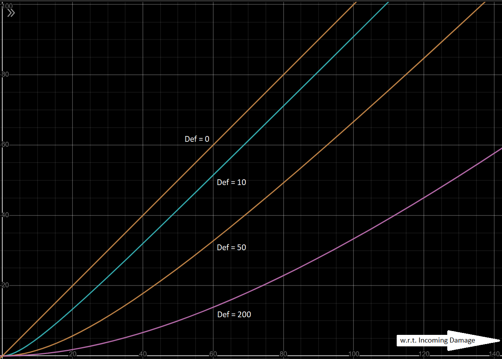


the beginning
the middle
.
# Introduction
# Character
# Combat
## Overview
- Combat is turn-based and symmetric. The number of turns each participant gets in a round is equal to the participant's Athletic skill, which also determines the turn order, except if the battle starts with an ambush (then the attacked team misses the first round).
- During their turns, participants have the option to Move or use a Spell instead of attacking with their weapons.
- Moving is one-dimensional, and the maximum distance moved per turn is also equal to the participant’s Athletic skill, unless teleportation is involved. Participants with any form of teleportation can move outside their own turns, and without limits. If the player's distance from the nearest enemy exceeds 100 (some combats may not allow this), combat ends.
- Dmg is based on only the weapon(s) that can attack an enemy at the chosen range. If the player chooses to attack an enemy outside the range of all of the player's equipped weapons, the turn will simply fail.
- Having low enough Spirit during combat causes the player to panic and be forced to move randomly during some turns until Spirit stabilises.
- Some spells require the player to skip one or more turns.
- Nothing in the inventory except Specials (potions and glyphs are examples of specials) can be accessed during combat, and no extra turn is lost by their usage, unless specified otherwise in the item description.

## Physical Damage
Physical damage is a vector of three dimensions. The three coefficients of physical damage are blunt damage, cutting damage and piercing damage. All calculations are done separately and symmetrically regarding these coefficients. Both the Def and Dmg attributes, as well as weapon Power and armour Rating are all 3D vectors. \
 \
**Things to note about dealing physical damage :**
- Outgoing physical damage is determined by the attacker’s equipped weapon(s), Strength attribute, Dmg modifiers, Martial skill and the defender’s Martial skill.
- The maximum damage potential of a weapon is its Power, and the further the Weight of a weapon exceeds the Strength of the wielder, the less effective it will become in proportion to its Power.
- If the Martial skill of a combatant is lower than that of the opponent's, the former's outgoing damage will be reduced, and the latter's increased. If the defender's Martial skill is double or more of that of the attacker's, the former will completely evade every attack from the latter.

**Things to note about receiving physical damage :**
- The attacker’s outgoing damage is the defender’s incoming damage. The damage taken is determined by the incoming damage, the defender’s equipped armour piece(s) (including shield) and Def modifiers.
- The further the total Weight of protective equipment exceeds Strength, the slower the wearer becomes.
- The defence potential of each piece of armour is its Rating. Each piece of physical armour contributes a fixed percentage to the wearer's Def attributes, for instance a cuirass has more effect on Def even if a pair of gauntlets have the same Rating, because torso armour protects 50% of the body, and hand armour protects only 5%.
- The percentage contribution of a shield to the Def attribute is ten times the wielder's Martial skill. However, not only does equipping a shield prohibit the usage of both hands for weapon, but the shield Weight counts towards total armour Weight.
- The Def attribute always reduces damage taken, but never completely eliminates it. The higher the incoming damage, the more damage will be subtracted, but the percentage of the damage reduced will become smaller.
- The amount of damage subtracted can never exceed the value of Def.

> If you are on GitHub and cannot see the following image, use a VPN or connect through a different ISP.


The above graph shows how received damage may change with respect to incoming damage at different fixed values of the Def attribute. More damage is blocked as the incoming damage increases, but the percentage of the incoming damage being blocked becomes smaller. \
For example, with Def=20, an incoming damage of 5 may be reduced to 1 (subtraction=4, percentage reduction=80%), and a damage of 30 may be reduced to 18 (subtraction=12, percentage reduction=40%). So as the incoming damage increases (5 to 30), the amount of the subtracted damage increases (4 to 12), but its value in relation to the total incoming damage, decreases (80% to 40%). [[also see Appendix-1]](#appendix-1)

### Calculation of outgoing physical damage:
```
WeaponDam = min(Power, Power*Strength/Weight)
BaseDmg = Sum of WeaponDams
E = max(0, (2*Martial-OppMartial)/Martial)
Outgoing = Mod(E*BaseDmg)
[In the Stats screen, E = 1]
```
### Calculation of physical damage received:
```
BaseDef = head*20% + torso*50% + arms*10% + legs*10% + hands*5% + feet*5% + shield*(10*Martial)%
= (head*4 + torso*10 + arms*2 + legs*2 + hands + feet + shield*2*Martial)/20
EffDamage = Inc*Inc/(Inc+Mod(BaseDef))
[Where Inc = Incoming damage]
```
# Gameplay
# Story
# World
# Technical Details
# Appendices
## Appendix-1
.
the end

