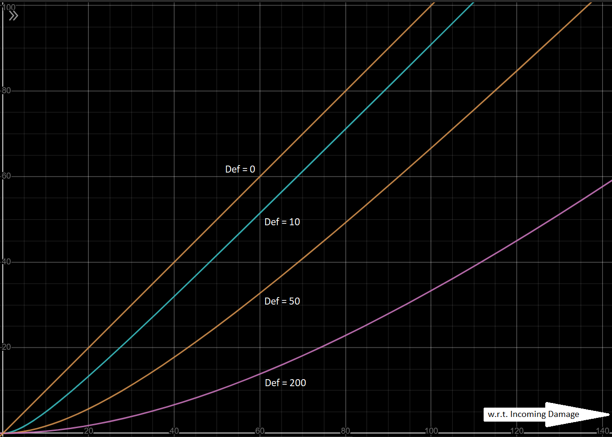

# Combat

## Overview

- Combat is turn-based and symmetric. The Athletic skill of each participant determines both order and frequency of the participant's turns in every round, except if the battle starts with an ambush (then the surprised team misses the first round).
- The turn distribution in each round with respect to Athletic skill is: `10,9,8,7,6,5,4,3,2,1,10,9,8,7,6,10,5,9,8,4,7,10,9,6,3,8,10,5,7,9,10,8,6,4,2,9,7,10,5,8,9,6,3,10,7,8,4,9,10,5,6,7,8,9,10`. Note that the number of turns each participant gets in a round is equal to the Athletic skill of the participant.
- Combat continues as long as the player is alive and there is at least one active hostile within 100 distance from the player. In other words, if the player's health falls to 0, if the last enemy is neutralised, or if the player's distance from the nearest enemy exceeds 100 (some combats may not allow this), combat ends.
- As long as there is at least one active hostile within 100 distance from the player, any other participant has to be at a distance more than 150 from the player (some combats may not allow this) to be considered out of combat. A combatant once considered to be out of combat does not have any part in the combat for the rest of its duration.
- During their turns, participants have the option to attack with their weapons, change weapons, move, or use a spell.
- Moving is one-dimensional, and the maximum distance moved per turn is equal to the participant’s Athletic skill, unless teleportation is involved.
- Participants with any form of teleportation can move once before using each of their regular turns, and the range of their movement is limited only by their teleportation. In essence, during each of their unskipped turns, they can move once and then take another action (and yes, the second action may also be movement).
- Having low enough Spirit during combat causes the player to panic and be forced to move randomly during some turns until Spirit stabilises.
- Outgoing damage is based on only the equipped weapon(s) which can attack an enemy at the chosen range. If the player chooses to attack an enemy outside the range of all of the player's equipped weapons, the turn will simply fail.
- Some spells may require the caster to skip one or more rounds (not turns) before or after the their usage. How many rounds need to be skipped depends entirely on the spell, and is not affected by the caster's Athletic skill.
- Nothing in the inventory except weapons and consumables (potions and glyphs are examples of consumables) can be accessed during combat, and using a consumable does not cost a turn, unless specified otherwise in the item description. However, the inventory cannot be accessed out of turn.

## Physical Damage

Physical damage is a vector of three dimensions. The three coefficients of physical damage are blunt damage, cutting damage and piercing damage. All calculations are done separately and symmetrically regarding these coefficients. Both the Def and Dmg attributes, as well as weapon Power and armour Rating are all 3D vectors.

### Dealing Damage

#### Things to note:

- Outgoing physical damage is determined by the attacker’s equipped weapon(s), Strength attribute, Dmg modifiers, Martial skill and the defender’s Martial skill.
- The maximum damage potential of a weapon is its Power, and the further the total Weight of equipped weapon(s) exceeds the Strength of the wielder, the less effective each weapon will become in proportion to its Power.
- If the Martial skill of the attacker is lower than that of the defender, for each attack from the former, the latter has a chance to completely evade it. In that case, the chance of the attacker's hits to connect is given by the ratio of the attacker's and the defender's Martial skills. If the attack is evaded, any accompanying effects are also evaded.

#### Calculations:

```
Chance to hit = min(1, Martial/OppMartial)
WeaponDam = min(Power, Power*Strength/TotalWeight)
BaseDmg = Sum of valid WeaponDams
Outgoing = Mod(BaseDmg)
```

### Taking Damage

#### Things to note:

- The attacker’s outgoing damage is the defender’s incoming damage. The damage taken is determined by the incoming damage, the defender’s equipped armour piece(s) (including shield) and Def modifiers.
- The further the total Weight of equipped apparel exceeds the wearer's Strength, the slower the wearer becomes.
- The defence potential of each piece of armour is its Rating. Each piece of physical armour contributes a fixed percentage to the wearer's Def attributes, for instance a cuirass has more effect on Def even if a pair of gauntlets have the same Rating, because torso armour protects 50% of the body, and hand armour protects only 5%.
- The percentage contribution of a shield to the Def attribute is ten times the wielder's Martial skill. However, not only does equipping a shield prohibit the usage of both hands for weapon, but the shield Weight counts towards total apparel Weight.
- The Def attribute always reduces damage taken, but never completely eliminates it. The higher the incoming damage, the more damage will be subtracted, but the percentage of the damage reduced will become smaller.
- The amount of damage subtracted can never exceed the value of Def.

#### Calculations:

```
BaseDef = head*20%+torso*50%+arms*10%+legs*10%+hands*5%+feet*5%+shield*(10*Martial)%
= (head*4+torso*10+arms*2+legs*2+hands+feet+shield*2*Martial)/20
EffDamage = Inc*Inc/(Inc+Mod(BaseDef))
[Where Inc = Incoming damage]
```



<details>
<summary>If you cannot see this image on GitHub...</summary>

Certain ISPs (like Jio) block _raw.githubusercontent.com_ for some reason, which causes repository images to not load. If you have this problem, please use a VPN or connect through a different ISP.

</details>

The above graph shows how received damage may change with respect to incoming damage at different fixed values of the Def attribute. More damage is blocked as the incoming damage increases, but the percentage of the incoming damage being blocked becomes smaller. \
For example, with Def=20, an incoming damage of 5 may be reduced to 1 (subtraction=4, percentage reduction=80%), and a damage of 30 may be reduced to 18 (subtraction=12, percentage reduction=40%). So as the incoming damage increases (5 to 30), the amount of the subtracted damage increases (4 to 12), but its value in relation to the total incoming damage, decreases (80% to 40%). [[also see Appendix-1]](Appendices.md#appendix-1-a-rant-about-ac)

## Modifiers

Modifiers change the effective Dmg or Def attribute of the combatant during each turn. The order of applying combat modifiers is as below:

Racial, Class, Enchantment, Effect, Opposition, Chaos \
[Within each type, additive modifiers are applied on top of multiplicative ones]

Enchantments come from equipped items. \
Effects come from spells, abilities, blessings, penalties and carried items. \
Opposition modifiers are effectiveness buffs and debuffs against certain enemies or equipments. \
Chaos is a somewhat random additive modifier. Chaos level is determined at the beginning of combat. There are 5 levels of Chaos: Low, Mild, Moderate, High, Extreme. These are the respective ranges of Chaos at each level:

* Low = -2 to +2
* Mild = -6 to +6
* Moderate = -12 to +12
* High = -20 to +20
* Extreme = -32 to +32

In Azerog (Warmouth), Chaos level is never below Moderate. But in most other places, it is rarely above Moderate. Each gem of Nurileth elevates the combat by one Chaos level. The Chaos modifier is rolled during each turn based on the Chaos level and added to the attacking Dmg of that turn. Chaos also affects transactions but with a different mechanism.
