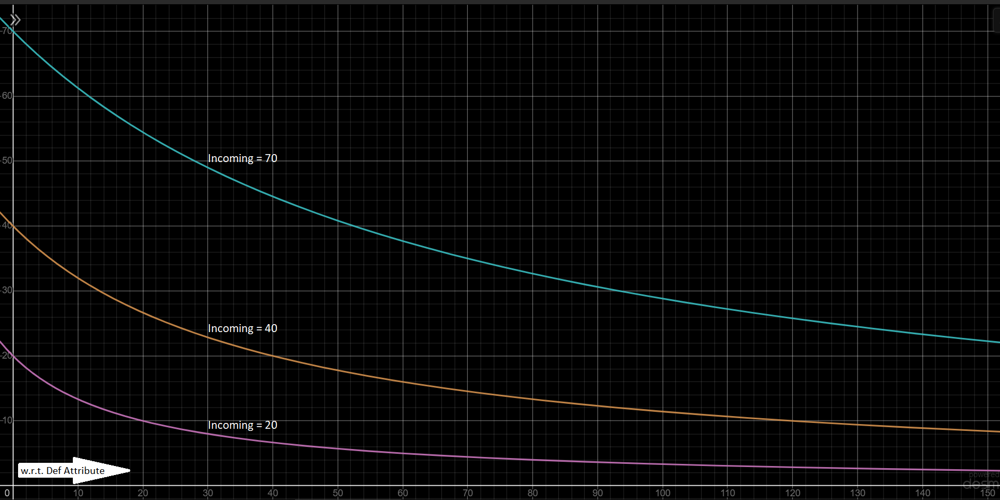

# Appendices

## Appendix-1: A Rant About AC

I did not want to implement AC the way it works in D&D, because it feels to me less like armour and more like dodging skill. Since no one wants to engage in even more number crunching in the middle of an intense battle, that is good enough for a TTRPG. But in a game where all the calculations are handled by the computer, we can do better. The two simplest and perhaps the most common ways to calculate defence in games are what I call "cutoff" and "damping". In the former, a flat amount is removed from the incoming damage, and in the latter a fixed fraction of the incoming damage is absorbed. One subtracts, the other divides. But in my opinion, neither of these reflect reality adequately. The problem with "damping" is that in reality, a piece of armour that can absorb most of a light attack is not guaranteed to absorb an equal percentage of a much heavier attack. On the other hand, "cutoff" armors have been given the potential to entirely nullify smaller attacks, whereas in reality we can feel softer knocks and bumps even through something that can protect us from stronger hits. One way we could avoid these two problems is by using a hybrid process to calculate defence. It could be a "damping" defence up until a threshold value, after which it becomes a "cutoff" defence. But this solution did not feel as elegant as the one I eventually came up with. And I was so proud of the one I came up with, that I finally ended up using it in my game just to serve my insatiable vanity. Now as the attacks get stronger, armour absorbs lower percentages of the total incoming damage, but the value of the subtracted damage gets higher. This also happens through a single, very simple formula which makes the curve smooth and pretty (nerds call it differentiable) unlike the jagged curve of the previously mentioned hybrid solution (which needed two separate formulas for damage values below and above the threshold). I am not aware of any games already using my system, and I will be very sad if I find out one that does, because I came up with this system all by myself and am very fond of it.

Here is a random graph that was lying around in my screenshots and was too nice looking to waste. It shows how effective damage decreases with increasing defence, when the incoming damage is constant. Also, the curves more or less accurately represent the trajectory of my life since I became an adult:



## Appendix-2: Combat and Time

The idea is that each round lasts for 5 seconds. The turnrate of a combatant is supposed to be the number of actions said combatant can take within those 5 seconds (disregarding teleportation). So a combatant with a turnrate of 10 can make an attack every half second, and so on. Therefore, the number of turns each combatant gets in a round is equal to the combatant's turnrate, and because combatants with a higher turnrate should also be quicker at the draw, all the combatants get their first turns in the descending order of their turnrates. The higher their turnrates, the quicker they get their next turn as well. The turn distribution in each round with respect to turnrate is as following:

```
10, 9, 8, 7, 6, 5, 4, 3, 2, 1, 10, 9, 8, 7, 6... 
10, 5, 9, 8, 4, 7, 10, 9, 6, 3, 8... 
10, 5, 7, 9, 10, 8, 6, 4, 2, 9, 7... 
10, 5, 8, 9, 6, 3, 10, 7, 8, 4, 9... 
10, 5, 6, 7, 8, 9, 10... 

[Each line represents one second of combat]
```

What this list of numbers means is that each round is divided into 55 uneven slots. The game iterates through the list, and at each slot, all the combatants with turnrate equal to the given number gets their turns. If two combatants have the same turnrate and belong to the same team then whoever appears earlier in that team's list goes first, but if they have the same turnrate and belong to opposing teams then the one who is not in the player's party goes first. If a timespan has to last for n rounds, that means it lasts for 55n slots, or in other words, it ends before the same slot, n rounds later. Here, timespan refers to anything from the duration of an effect to the preparation time for a spell.
